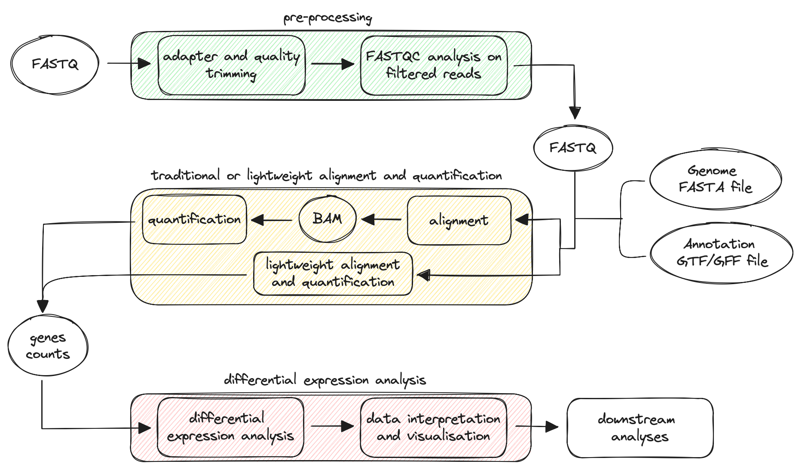
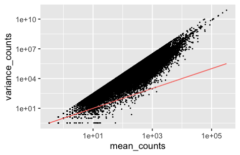

# RNAseq Analysis

Before we dive into the nf-core pipeline for analysing RNA-sequencing data, it's worth looking at some theoretical aspects of RNA-seq.


## Overview

Given the central role of RNA in a wide range of molecular functions, RNA-seq has emerged as a powerful tool for measuring the presence and levels of RNA species in biological samples. The technique is based on next-generation sequencing (NGS) technologies and is now considered the gold standard in the field of transcriptomics.

After RNA extraction and reverse transcription into complementary DNA (cDNA), the biological material is sequenced, generating NGS "reads" that correspond to the RNA captured in a specific cell, tissue, or organ at a given time. The sequencing data is then bioinformatically processed through a typical workflow summarised in the diagram below:



In the scheme, we can identify three key phases in the workflow: 

- **data pre-processing**: raw reads are handled to remove adapters or contaminants enhancing their quality;


- **traditional or lightweight alignment and quantification**: reads are mapped to a reference genome, and gene abundance is estimated. The workflow can also follow an alternative route based on lightweight alignment and quantification, reducing the time required for the analysis.


- **differential expression analysis**: differentially expressed genes are identified using statistical tests, annotated, and visualised.

Depending on the user's needs, the workflow can include additional downstream analyses such as functional enrichment analysis, co-expression analysis, and integration with other omics data.


## Pre-processing 

The pre-processing of sequencing reads from RNA-seq data is a critical step to ensure the quality and accuracy of downstream analysis. The raw reads obtained from the sequencer are stored as [FASTQ](https://en.wikipedia.org/wiki/FASTQ_format) files, which contain both the sequence data and quality scores. The initial processing step involves evaluating the quality of the reads to identify potential issues such as adapter contamination, sequencing errors, or low-quality bases. The presence of adapters (short DNA sequences ligated to the ends of DNA fragments during library preparation) is firstly detected through comparison with known adapter sequences or by using algorithms that identify adapter-like sequences. These sequences are then removed in a process known as **read trimming**. Next, reads containing contaminants (genomic DNA and/or rRNA), and those with low-quality bases are filtered out. Finally, the quality of the filtered reads is checked to ensure their suitability for downstream processing.


## Alignment (or lightweight alignment) and quantification

In the RNA-seq workflow, the alignment step involves mapping sequencing reads to a reference genome or transcriptome to determine the position and orientation of each read relative to the reference sequence.

Errors, gaps, regions of poor sequence quality, insertions/deletions (INDELs), as well as duplicated, and repetitive regions in the reference sequence, make this step challenging. Addressing these issues by choosing a high-quality reference and an appropriate aligner is essential for accurate results. A crucial component in the alignment step is the [annotation](https://www.ncbi.nlm.nih.gov/genbank/genomes_gff) file, which can be in General Feature Format (GFF) or Gene Transfer Format (GTF). These files contain key information about the location, and structure of genes and transcripts, playing an essential role in accurate mapping and gene expression quantification. Additionally, RNA-seq data often includes reads that span exon-exon junctions, and the annotation files provide information about splice junctions, allowing for the detection of different isoforms.

The alignment and quantification steps can follow two different approaches depending on user preferences:

- traditional alignment and quantification;


- lightweight alignment and quantification.

In RNA-seq analysis, traditional alignment is often performed with **splice-aware aligners**, which are designed to recognise the splicing process. These aligners can align reads across known splice junctions and detect novel splice sites or alternative splicing events. Popular splice-aware aligners include [STAR](https://github.com/alexdobin/STAR), and [HISAT2](https://github.com/DaehwanKimLab/hisat2). Once alignment is complete, the following step is quantification, which involves estimating the abundance (number of reads) associated with each gene. Tools like [featureCounts](https://subread.sourceforge.net/featureCounts.html), [HTSeq](https://htseq.readthedocs.io), [Salmon](http://combine-lab.github.io/salmon), and [RSEM](http://deweylab.github.io/RSEM) are commonly used for this purpose.

Traditional alignment tools are time-consuming and require substantial computational resources, particularly in terms of memory, and CPU usage. Alternatively, methods based on **lightweight alignment** allows for faster analysis by determining the likely origin of reads without a full, base-by-base alignment. Lightweight alignment tools like [Kallisto](https://pachterlab.github.io/kallisto/about.html), [Sailfish](http://www.cs.cmu.edu/~ckingsf/software/sailfish), and [Salmon](https://salmon.readthedocs.io/en/latest/salmon.html) avoid full-scale alignment, providing quantification estimates more quickly than traditional splice-aware algorithms, while still maintaining high accuracy. The quantification results from these tools are often called **pseudocounts** or **abundance estimates**, which can be used for downstream analysis.

!!! info

    Salmon can be run in two different modes: alignment-based mode or quasi-mapping mode. In the first mode, Salmon estimates abudance starting from `bam` file obtained with the chosen aligner. In the second mode, Salmon requires a reference transcriptome and raw reads to perform both mapping and quantification.


## Differential expression (DE) analysis with DESeq2

Differential expression analysis is a statistical method for comparing gene expression levels between different experimental conditions, such as disease vs healthy (e.g., tumour tissue vs healthy tissue), treatment vs control (e.g., a sample treated with a specific stimulus, drug, or compound vs an untreated sample), and tissue vs tissue (e.g., brain vs heart). Differential expression analysis aims to assess, for each gene, whether the observed differences in expression between groups are statistically significant, accounting for the variation observed within groups (replicates). This part of the analysis is typically performed in R using various packages, such as [DESeq2](https://bioconductor.org/packages/release/bioc/html/DESeq2.html), [edgeR](https://bioconductor.org/packages/release/bioc/html/edgeR.html), and [limma](https://bioconductor.org/packages/release/bioc/html/limma.html). This tutorial focuses on **DESeq2**, a popular R package known for its robustness. For more detailed information, see the [DESeq2 vignette](https://bioconductor.org/packages/devel/bioc/vignettes/DESeq2/inst/doc/DESeq2.html).

The analysis begins with the input data, which generally consist of a count matrix obtained during the alignment and quantification step, summarising the expression levels of the different genes in each sample of the dataset. The rows of the matrix typically correspond to genes, while the columns represent the samples. Another essential prerequisite is a metadata table describing the samples.


### Quality Control

To ensure robust differential expression results, it is common to start by exploring the sources of variation in the data. DESeq2 provides quality control tools, including Principal Component Analysis (PCA) and hierarchical clustering. PCA is used to reduce the dimensionality of the data, allowing the visualisation of the samples in a lower-dimensional space. In contrast, hierarchical clustering shows the correlation of gene expression for all pairwise combinations of samples in the dataset. These methods can identify groups of samples with similar behaviour, as well as potential outliers or unexpected patterns.

Quality control in DESeq2 typically uses **variance-stabilised (vst)** or **regularised log-transformed (rlog)** counts. Since raw counts in RNA-seq follow a discrete distribution, which is not suitable for many statistical and machine learning algorithms that assume continuous distributions, transformations such as `vst` and `rlog` are applied to stabilise the variance across genes. This stabilisation ensures that, after transformation, genes with both low and high expression levels have variances that are more comparable, making the data more suitable for downstream analyses.

Finally, it is often beneficial to filter out genes that are unlikely to show differential expression, such as those with zero counts across samples or extreme count outliers. By filtering out these genes, we can increase the sensitivity of our differential expression analysis, and reduce the risk of false positives.

!!! note

    The `vst` or `rlog` transformations are applied to the normalised counts stored in the `dds` object, which is generated by running either the `DESeq()` or `estimateSizeFactors()` function. Since the estimation of size factors is an early step in the `DESeq()` function, the transformations are generally applied immediately afterwards. 


### Design Formula

The design formula specifies the sources of variation that the statistical model needs to account for. It defines how the counts will be related to the experimental conditions, allowing the software to model the relationship between gene expression and the factors of interest, such as treatment, time points or batch effects. It is important to specify the main factor of interest as well as additional covariates in the design formula.

A well-defined design formula can account for potential confounding variables. For instance, if the experiment includes multiple conditions, specifying these in the design helps to isolate the effect of the primary variable of interest on gene expression. An example is provided below:

```r
# Basic design with a single factor of interest

design = ~ condition

# Design including covariates to control for sex and developmental stage

design = ~ sex + developmental_stage + condition
```

!!! Tip 

    In R, the tilde (`~`) is used in formula syntax to specify relationships between variables in statistical models. Here, it indicates that gene counts (dependent variable) will be modelled as a function of the specified variables (predictors).


The results will not be affected by the order of variables but the common practice is to specify the main source of variation in the last position of the design formula.


### Differential Expression Analysis

RNA-seq data typically contain a large number of genes with low expression counts, indicating that many genes are expressed at very low levels across samples. At the same time, RNA-seq data exhibit a skewed distribution with a long right tail due to the absence of an upper limit for gene expression levels. This means that while most genes have low to moderate expression levels, a small number are expressed at high levels. Accurate statistical modelling must therefore account for this distribution to avoid misleading conclusions.

<figure markdown="span">
  { width="400"}
</figure>

The core of the differential expression analysis is the `DESeq()` function, a wrapper that streamlines several key steps into a single command. The different functions are listed below:

<figure markdown="span">
  { width="400"}
</figure>

!!! note

    While `DESeq()` combines these steps, a user could choose to perform each function separately to have more control over the whole process.

The different steps are explained in detail below:

1) **Normalisation**: since DESeq2 compares counts between sample groups for the same gene, it does not need to adjust for gene length. However, it is essential to account for variations in sequencing depth and RNA composition among samples. To normalise the data, DESeq2 utilises **size factors**.

The size factors are calculated using the **median ratio** method:

- **Calculate the geometric mean**: for each gene, compute the geometric mean of its counts across all samples. This gives a row-wise geometric mean for each gene;


- **Calculate ratios**: divide each gene's count by its geometric mean to obtain a ratio for each sample;


- **Determine size factors**: for each sample, take the median of these ratios (column-wise) to derive the size factors;


- **Normalise counts**: divide each raw count by the corresponding sample size factor to generate normalised counts.

!!! note

    While normalised counts are useful for downstream visualisation of results, they should not be used as input for DESeq2. Instead, DESeq2 requires raw count data in the form of a matrix of integer values.

2) **Estimate dispersion and gene-wise dispersion**: the dispersion is a measure of how much the variance deviates from the mean. The dispersion estimates indicate the variance in gene expression at a specific mean expression level. Importantly, RNA-seq data are characterised by **overdispersion**, where the variance in gene expression levels often exceeds the mean (variance > mean).

<figure markdown="span">
  { width="400"}
</figure>

DESeq2 addresses this issue by employing the **negative binomial distribution**, which generalises the Poisson distribution by introducing an additional dispersion parameter. This parameter quantifies the extra variability present in RNA-seq data, providing a more realistic representation than the Poisson distribution, which assumes mean = variance. DESeq2 starts by estimating the **common dispersion**, a single estimate of dispersion applicable to all genes in the dataset. This estimate provides a baseline for variability across all genes in the dataset. Next, DESeq2 estimates **gene-wise dispersion**, a separate estimate of dispersion for each individual gene, taking into account that different genes may exhibit varying levels of expression variability due to biological differences.
The dispersion parameter (α) is related to the mean (μ), and variance of the data, as described by the equation:

`Var = μ + α ⋅ μ²`

A key feature of DESeq2's dispersion estimates is their negative correlation with the mean, and positive correlation with the variance. Genes with low expression tend to have higher dispersion values, while genes with high expression tend to have lower dispersion. 

3) **Mean-dispersion relationship**: this process, known as dispersion fitting, models the relationship between the mean expression level of a gene, and its dispersion. DESeq2 assumes that genes with similar expression profiles share similar dispersion patterns, and leverages this information to refine the estimates identifying a trend in the dispersion estimates across genes. The fitted curve, typically a smooth curve, describes how dispersion changes as a function of the mean expression level.

4) **Final dispersion estimates**: DESeq2 refines the gene-wise dispersion by shrinking it towards the fitted curve. The "shrinkage" helps control for overfitting, and makes the dispersion estimates more reliable. The strength of the shrinkage depends on the sample size (more samples = less shrinkage), and how close the initial estimates are to the fitted curve.

<figure markdown="span">
  { width="400"}
</figure>

The initial estimates (black dots) are shrunk toward the fitted curve (red line) to obtain the final estimates (blue dots). However, genes with exceptionally high dispersion values are not shrunk, as they likely deviate from the model assumptions exhibiting elevated variability due to biological or technical factors. Shrinking these values could lead to false positives.

5) **Fitting model and testing**: the initial step in hypothesis testing involves defining a **null hypothesis** for each gene. In DESeq2, The null hypothesis states that there is no difference in expression between the sample groups (log2 fold change == 0). Next, DESeq applies a statistical test to assess whether the null hypothesis is true.
DESeq2 fits a **generalised linear model (GLM)** to the normalised counts using the calculated size factors and final dispersion estimates. A GLM is a flexible extension of linear regression that models the relationship between a response variable (normalised counts), and predictors (e.g., condition).
By using a **negative binomial distribution**, DESeq2's GLM can handle the additional variability in gene expression counts that often occurs in RNA-seq data. Once the model is fit, coefficients are estimated for each sample group along with their standard errors. These coefficients represent the estimated log2 fold changes between groups, and serve as the basis for hypothesis testing, using either a **Wald test** or a **Likelihood Ratio Test (LRT)**, depending on the experimental design:

- **Wald Test**: The Wald test is ideal for simpler experimental designs, such as comparing two conditions (e.g., treated vs untreated). In DESeq2, the Wald test is implemented by calculating the log2 fold change and dividing it by its standard error to obtain a z-statistic. This z-statistic is then evaluated against a standard normal distribution, leading to the computation of a p-value that indicates the likelihood of observing a z-statistic as extreme as the calculated value under the null hypothesis. When the p-value is small, we reject the null hypothesis, concluding that the gene is differentially expressed.
  
- **Likelihood Ratio Test (LRT)**: The LRT is more suitable for complex experimental designs involving multiple variables. It compares the fit of two nested models: the full model, which includes the factor of interest (e.g., treatment), and the reduced model, which excludes that factor. This approach allows DESeq2 to account for confounding variables and to isolate the effect of specific variables on gene expression. In contrast to the Wald test, which assesses up- or down-regulation between two conditions, the LRT identifies genes that exhibit changes in expression in any direction across multiple sample classes, thereby making it more appropriate for multi-factor analyses.

Regardless of the utilised test, for each gene DESeq2 computes a log2 fold change along with an associated p-value. The p-value is the result of a single test (single gene), but in the case of RNA-seq data thousands of genes are tested, increasing the false positive rate.
To account for this, DESeq2 employs multiple test correction methods (the Benjamini-Hochberg procedure is the default) to adjust the p-values, and control the false discovery rate (FDR). The FDR is the expected proportion of false positives among the identified significant results.

!!! Example

    By setting the FDR cutoff to < 0.05, 5% of genes identified as differentially expressed are expected to be false positives. For instance, if 400 genes are identified as differentially expressed with an FDR cutoff of 0.05, you would expect 20 of them to be false positives. 

After identifying DE genes using DESeq2, it is essential to interpret the biological significance of these genes through functional analysis. This involves examining the roles of the differentially expressed genes in various biological processes, molecular functions, and pathways, providing insights into the underlying mechanisms driving the observed changes in gene expression. This interpretation can help in discovering pathways involved in disease or identifying potential therapeutic targets. Different tools are available to carry out these functional analyses, such as [Gene Ontology](https://geneontology.org), [Reactome](https://reactome.org/), [KEGG](https://www.genome.jp/kegg), [clusterProfiler](https://bioconductor.org/packages/release/bioc/html/clusterProfiler.html), [g:Profiler](https://biit.cs.ut.ee/gprofiler), and [WikiPathways](https://www.wikipathways.org).
